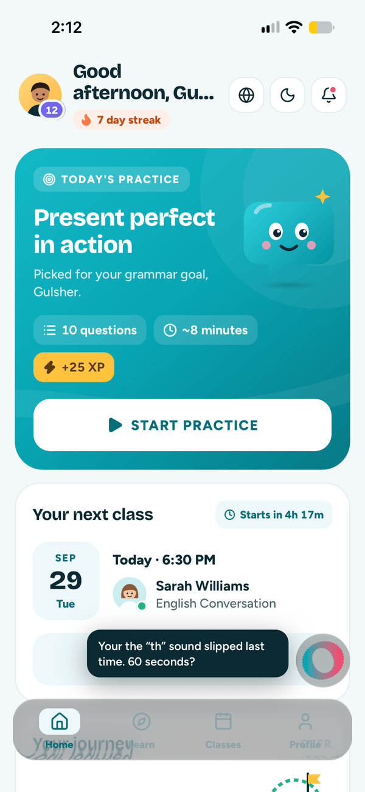
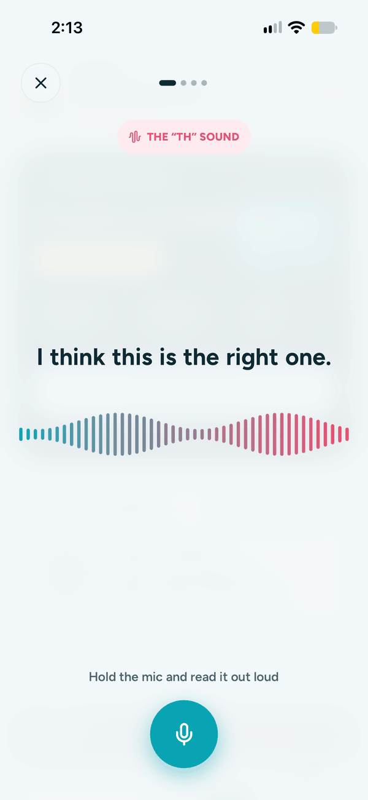
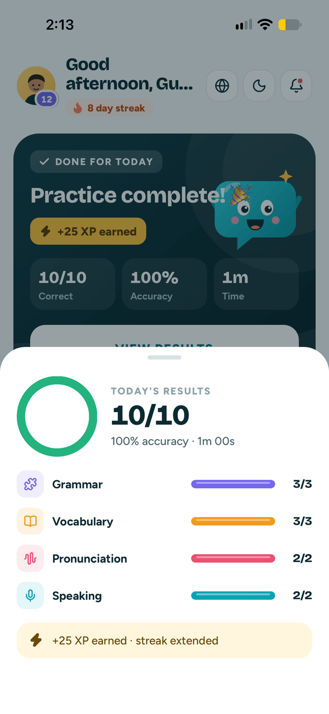
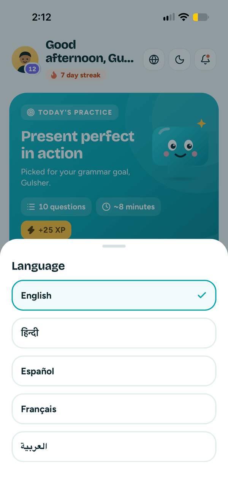

# Skillio

An EdTech app that teaches English to 10–20 year olds. This is the frontend take-home: the
onboarding flow, the Home screen it hands off to, a practice session, a celebration, and an AI
speaking coach.

Built with Expo SDK 57 / React Native 0.86 / React 19. Everything is hardcoded — it's a UI/UX build,
not a data one.

---

## Screenshots & video

| Home | Speaking coach | Results (dark) | Languages |
| --- | --- | --- | --- |
|  |  |  |  |

The full set is in `/screenshots` — six onboarding screens, Home and its progress card, the practice
flow and the celebration. A short walkthrough video and the release APK are attached to the email.

---

## Running it

```bash
npm install
npx expo run:ios       # or: npx expo run:android
```

**A dev build is required — Expo Go won't work.** Skia draws the confetti and the coach's waveform,
and `expo-audio` records the microphone. Neither ships in Expo Go. After the first run,
`npx expo start` is enough.

The speaking coach needs a real microphone, so use a device rather than the simulator.

```bash
npm run apk            # signed release APK → build/
npx tsc --noEmit       # typecheck
npx expo lint          # lint
```

---

## Highlights

**Onboarding → Home.** Eight onboarding screens that actually feed the Home payload — the name, level
and focus you pick show up on the other side. Home is the main deliverable and is ordered by what a
student needs first: today's practice, then class, then progress, then the diagnostic, then rewards,
then billing last.

**AI speaking coach.** A floating orb on Home that expands into a read-aloud session. You hold the
mic, read a line, and it scores you word by word, then speaks the correction back. The mic, waveform
and silence detection are real; the per-word verdicts are scripted, since phoneme-level scoring is a
paid cloud API. The orb and the waveform are one Skia surface — the ring unrolls into the waveform
rather than cross-fading.

**Light and dark mode.** Both ship, persisted, following the system until you override it. Two
palettes with identical keys; stylesheets are built once per palette, so flipping swaps a reference.

**Five languages.** English, Hindi, Spanish, French and Arabic, detected on first launch. Arabic
flips the layout to RTL. The English being *taught* stays English — only the interface translates.

**Skia and Reanimated throughout.** All animation runs on the UI thread. Skia handles the confetti
and the coach's waveform; Reanimated handles the sticky header, the journey path, counting numbers
and every transition. Reduce Motion is respected.

**Every state is reachable.** Long-press the avatar on Home to open a state switcher — no class, no
skill data, no lessons left, no subscription, practice done or not. There are deep links too:

```bash
npx uri-scheme open "skillio://home?state=noclass" --ios
# scheduled · noclass · notdone · done · noskills · nolessons · nosub
```

---

## Notes on the payload

The brief's fields are used verbatim. I added a few: practice topic and focus label (so the card can
say *why* this practice), question count / minutes / XP (what a student weighs before tapping), a
practice result object, and the gamification block. `scheduledClass.time` is an ISO string rather than
a formatted one, so it can drive both "Today · 6:30 PM" and a live countdown.

Edge states express emptiness with values rather than by dropping fields — the payload shape stays
constant.

---

## Known limitations

- Dev build required (Skia, `expo-audio`).
- The coach's per-word scoring is scripted. The microphone and waveform are real.
- Nothing is done with the recording — no upload, no playback.
- Learn, Classes and Profile tabs are out of scope and say so when tapped.
- No persistence beyond language and theme; restarting resets the demo state.

---

## On tooling

I built this with **Claude Code**, mostly for the mechanical work — theming migrations, locale files,
and the Skia and Reanimated plumbing once I'd decided what it should do. The design and product calls
are mine, including the one that shaped the coach: it started as a chat assistant and became a voice
coach instead.

Happy to walk through any of it in detail.
